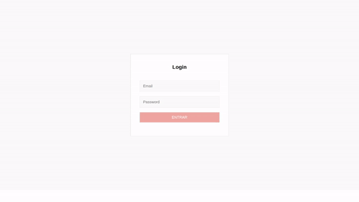

# Hi, I'm Raphael Barzotto 👋

- ⚙️ Mechanical Engineer at [Federal University of Technology - Paraná](http://www.utfpr.edu.br/)
- 💻 In 2021 decided to study full-stack web-development at [Trybe](https://www.betrybe.com/)
- 👨‍💻 Currently open to work

## ⌨️ Languages and Tools 🖱
| Frontend | Backend | Tests | Tools |
| ---- | ----- | ----- | ----- |
|  |  |  |  |
|  |  |  |  |
|  |  |  |  |
|  |  |  |  |
|  |  |   | |
|  |  | | |
|  | | | |
|  | |
|  |

### 💻 Languages 👨‍💻

## 🔨 Some of my projects 🔧
### Wallet app using react redux

- To see more, check pinned repositories below